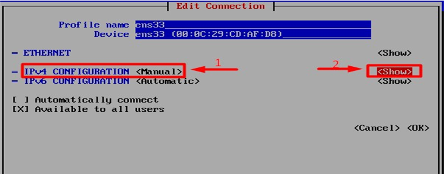
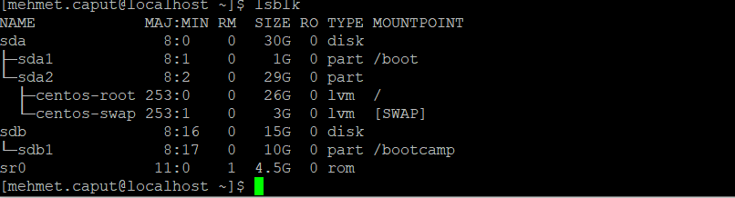

# Case - 1

## 1.1 Sanal makinada bir Centos kurup, güncellemelerinin yapılması

*Kurulacak dağıtım dosyaları

*Makinenin barındırılacağı sanallaştırma ortamı

Bu yazımızda sanallaştırma ortamı olarak  VMware® Workstation 16 Pro Version:16.1.0 build-17198959 kullanılacaktır. Kuracağımız dağıtım Centos 7 olarak seçilmiştir.

[VmWare Download Link](https://www.vmware.com/products/workstation-player/workstation-player-evaluation.html "VMware")

[Centos 7 Download Link](https://www.centos.org/download/ "Centos 7")

Gerekli araçların kurulum dosyaları yukarıda linklenmiş vaziyettedir.
VMware Workstation 16 Pro içerisinde sanal makine oluşturmak için “Create a New Virtual Machine” butonuna tıklıyor. (Kısa yolu Ctrl+N)


Açılan sayfada bizleri yapacağımız kurulum hakkında detayları soran bir ekran karşılayacak. Bu ekranda detaylara önem vererek kurulum yapacağımız için gelişmiş seçeneğini seçiyoruz.


(Advanced Options seçildi)

Next butonu sonrasında karşımıza gelen sekme kuracağımız sanal makinenin hangi alt yapıyı kullanacağını belirlememiz imkan sağlamakta, sunucu ortamımız kapsamlı olmadığı için VMware ürünleri ile entregrasyon/import/export gibi işlemler gerçekleştirmeyeceğiz, bu nedenle default olarak gelen Version 16 olanı seçiyorum.

(Workstation Hardware Options)

Next butonu sonrasında karşımıza gelen sekme sanal makinemizde kullanacağımız işletim sistemimizi yüklememize olanak sağlayan bir ekrandır, bu ekranda kullanacağım .iso dosyasının olunu tanımlayıp  ilerliyorum. 


(İşletim sistemi seçildi)

Next butonu sonrasında karşımıza gelen sekme oluşturduğumuz sanal makinenin barındırılacağı konum ve bu makinenin adını tanımladığımız ekrandır.

(Lokasyon ve isim tanımlandı)

Next butonu sonrasında karşımıza gelen sekme oluşturduğumuz sanal makineye tanımlayacağımız işlemci miktarını belirlediğimiz alandır. 

(2 core  olmak üzere toplamda 2 thread tanımlandı)    

Next butonu sonrasında karşımıza gelen sekme oluşturduğumuz sanal makineye tanımlayacağımız ram miktarını belirlediğimiz alandır. 

(4 GB ram tanımlandı)

Next butonu sonrasında karşımıza gelen sekme oluşturduğumuz sanal makinemizin network bağlantı ayarlarını gerçekleştiriyoruz, oluşturacağımız cihazısın ana makinem ile aynı vlan içerisinde olmasını istiyorum bu nedenle Bridge Mode aktif olarak kullanacağım.

(Bridged mode aktif edildi)

Arada kullanılacak olduğumuz disk ile ilgili aşırı ileri ayarları varsayılan bırakıp ilerledim.
Devamında beni kullanacak olduğum disk kapasitesini ayarlayabileceğim bir ekran karşıladı.


Tavsiye edilen centos 7 64 bit disk alanı 20 GB 
(Allocate all disk space now  seçilen boyutu disk üzerinden tek seferde almanıza sebep olur, bu tik kaldırıldığın sanal makineniz kurulu olduğu disk üzerinde tanımladığınız boyutun (bu makine için 30 GB tanımladım) kullanıldığı kadarını tüketir.)

**Diğer ayarları default bırakıp FINISH butonuna bastım ve makineyi başlattım.**

## Centos 7 Kurulumu

(Install Centos 7)

Sanal makinemize start verdikten sonra açılan sanal makinemizde bizi centos boot ekranı karşılamakta, ilk kurulum esnasında oluşturduğumuz sanal makine üzerine centos 7 kurabilmek için Install Centos 7 opsiyonunu  seçiyoruz.

(Dil olarak İngilizce seçildi)

Dil ayarlarımızı seçtikten sonra “Continue” rotasında devam edebiliriz. 
Sonraki ekran centos kuracağımız lokasyonu ayarlamamızı isteyen bir ekran karşılıyor bu ekranda Installation Destinaiton ekranında centos 7 makinemizin disk ayarlarını gerçekleştiriyoruz.


(Installation Destination içerisinden VMware aracılığı ile tanımladığımız 30 GB diski seçip ilerliyoruz)

Begin Installation butonuna tıkladığımızda Centos bizlere üzerinde yetkili olacak hesabın şifresini oluşturmamızı istiyor

(Root Password ile yetkili hesabı şifresi oluşturuldu)

Bu esnada centos kurulumlarını altta devam ettirmekte kurulum tamamlandığında altta cihazı yeniden başlatabileceğimiz reboot butonu beliriyor
Kurulumun tamamlanabilmesi için makine yeniden başlatılıyor.


Görmüş olduğunuz gibi işletim sistemimiz kullanıma hazırdır. Centos 7 de repo güncellemelerini yapmak için öncelikle internete bağlı olmamız gerekmektedir.
Centos 7 işletim sisteminde default olarak NIC (Network Interface Card – Ağ Arayüz Kartı) birimleri kapalı olarak gelmektedir. Ağ Ara yüz Kartını aktif etmek ve Ağ ayarlarını yapmak için “nmtui” komutunu koşturalım ve Centos’ un ağ yönetim ara yüzüne geçelim.

```bat
nmtui
```
Karşımıza gelen ekranda Activate a connection seçeneğini seçip Ağ kartını aktif edelim


(Ağ kartı aktif edildi)

Ardından ağ ayarlarını yapmak için tekrar aynı ara yüz nmtui komutu ile giriş yapıyoruz bu sefer edit a connection seçeneği ile ağ konfigürasyonu gerçekleştireceğiz.


(IP Adresi manuel verildi)

Cihazımıın İP adresi boşta olduğunu biliğimiz 192.168.1.80 olarak ayarlandı dns için sorgularını google iletmesini istiyoruz bu nedenle de 8.8.8.8 olarak ayarlandı.


Ardından cihaza tanımladığımız ip adresinin doğruluğunu teyit ediyoruz.
Bunun için “ip address Show” komutu kullanıyoruz veya kısaca “ip a s”

Ardından işletim sistemimizin güncelliğini sağlamak için “yum update -y” komutunu koşturuyoruz sonucunda complete! Gördüğümüzde güncelleştirmelerimizin tamamlandığını anlıyoruz.

```bat
ip address show
yum update -y
```

(Güncelleştirmeler tamamlandı)


## 1.2 Kişisel bir user yaratılması (ad.soyad şeklinde) Not: aşağıdaki işlemler bu kullanıcı ile yapılacak

Sırada yeni kullanıcı oluşturma işlemi var bunun için “adduser” komutunu kullanıyoruz. Bu komutun aldığı parametleri görmek için -h parametleri eklenebilir ben kendi adımda bir kullanıcı oluşturmak için “adduser mehmet.caput” komutunu koşturacağım ardından oluşturduğum usera parola tanımlamak için “passwd mehmet.caput” komutunu kullanacağım.

```bat
adduser mehmet.caput
passwd mehmet.caput
```
(kullanıcı oluşturdum ve parola belirledim)


mehmet.caput kullanıcısının disk ekleme vb. işlemleri gerçekleştirebilmesi için kendisi root grubuna dahil edildi.

Bunun için visudo komutu çalıştırıldı.

```bat
visudo
```

Ardından işlemleri gerçekleştireceğim mehmet kullanıcısına geçmek için 
“su – mehmet.caput” komutunu kullandım.

```bat
su - mehmet.caput
```


Görüldüğü üzere artık mehmet.caput kullanıcısından devam edeceğiz. 
“lsblk” komutu ile mevcut diskleri görüntüleyebiliriz. 

```bat
lsblk
```


Sistemimizde disk ve partitionlar görüldüğü şekilde ayarlanmış.

Sistemimize 10 GB boyutunda yeni bir disk ekleyeceğiz bunun için vmware ekranından ilgili  cihaza “Edit virtual machine Settings” kısmına geliyoruz.


10 GB disk boyutu tanımlayıp diskimizi sanal makinemize ekliyoruz.
Disk ekleme işlemi gerçekleştirdikten sonra sistemimizin diski görmesi için “reboot” komutu ile centos’u yeniden başlatıyorum.


```bat
reboot
```
Sistem ayağa kalktığında “lsblk” ile tekrar baktığımızda diskimizin sdb olarak bağlandığını görüyoruz.

```bat
lsblk
```


Eklediğimiz diskin sdb olarak bağlandığı görülüyor sudo fdisk /dev/sdb komutu ile disk yönetim aracını çalıştırıyoruz bu araçta disk eklemek için n parametresi giriyoruz ardından p parametresi ile yeni bir bölüm oluşturacağımızı belirtiyoruz.
Ardından eklemek istediğimiz boyutu yazıp işlemi tamamlıyoruz.

```bat
sudo fdisk /dev/sdb 
```

sudo mkfs.ext4 /dev/sdb1 komutu ile dosya sistemimizi belirleyelim.


sudo mkfs.ext4 /dev/sdb1 komutu ile dosya sistemimizi belirleyelim.


```bat
sudo mkfs.ext4 /dev/sdb1
```


```bat
sudo mkdir -p /bootcamp 
sudo mount /dev/sdb1 /bootcamp 
sudo vi /etc/fstab 
sudo mount -a 
```

sudo mkdir -p /bootcamp komutu ile diskimizi mount edecek dizini oluşturalım.

sudo mount /dev/sdb1 /bootcamp /dev/sdb1 dizininde belirtilen diski önceden /bootcamp altında olan dizine mount işlemlerini gerçekleştirelim
sudo vi /etc/fstab altına yazarak işlemleri kalıcı haline getiriyoruz
sudo mount -a komutunu koşturarak disk mount işlemlerimizi tamamen sonlandırmış oluyoruz.



Görüldüğü üzere takılı disk üzerinden 10GB alan /bootcamp bölümü olarak eklendi.

## 1.4. /opt/bootcamp/ altında bootcamp.txt diye bir file yaratılıp, file'ın içerisine "merhaba trendyol" yazılması


```bat
sudo mkdir -p /opt/bootcamp 
sudo cd /opt/bootcamp/
sudo touch bootcamp.txt 
sudo chmod 777 bootcamp.txt
vi bootcamp.txt
cat bootcamp.txt 
```
Öncelik olarak sudo mkdir -p /opt/bootcamp dizinini oluşturalım.
cd ile oluşturduğumuz dizine geçelim
sudo touch bootcamp.txt komutunu ile bizden istenen metin dosyasını oluşturalım.
chmod 777 ile dosya izinlerini düzenleyelim.
vi editörü ile dosyamızı düzenledik içinde yazanları görüntülemek için cat komutunu koşturdum.

Görüldüğü üzere oluşturduğumuz bootcamp.txt dosyası içerisine merhaba trendyol yazıldı.

## 1.5. Kişisel kullanıcının home dizininde tek bir komut kullanarak bootcamp.txt file'ını bulup, bootcamp diskine taşınması


```bat
sudo find / -name 'bootcamp.txt' -exec mv -t /bootcamp/ {} +
```
Kullanıcının home dizininde “sudo find / -name 'bootcamp.txt' -exec mv -t /bootcamp/ {} +” komutu ile adı bootcamp olan .txt dosyasını bulup çıkan sonucu /bootcamp/ lokasyonuna taşınması gerçekleştirilmiştir.

